Scalable and fast storage for JBoss Fuse using JBoss Data Grid
=====================================

This demos show how to use the camel-jbossdatagrid component as a fast storage to an integration case.

Setup
---------------
To setup the infrastructure for the demo download the follwoing files to the `installs` directory:

* jboss-fuse-full-6.2.0.redhat-133.zip

After that run the `init.sh` script

		$ sh init.sh

Demo storty
-----------
A stock market broker needs to provide it's brokers with historical data of past stock volume (amount of shares that trade hands from sellers to buyers). And also needs to list all today's buyer's shares in the console after displaying the past volume. The broker decides to send order information to trigger stock tick event, the information are send to JBoss Fuse. It implements a integration flow to request for historical data from external SAAS, then pass the data to stock ticker console, and then process the order by parsing the XML to Java POJO for display and further process. 

The problem
-----------
The volume of historical stock tick data is very high and to be able to consume the events without overflowing the integration the sizing team has calculated that the integration flow needs to be able to process an event in under 10 ms. To be able to meet the requirement of storing the last 100 events they it department has identified that their standard database storage, that has an SLA of 500 ms for a write operation, is will not be able to meet this requirement. Also the inital data that triggers the event contains customer information, this information should not be passed to external services. 

The solution
------------
JBoss Data Grid recently (since 6.4) introduced a camel component capable of storing high volume of data in-memory. It also provides eviction strategy where the data grid automatically can evict events based on different algorithms like FIFO, LIRS etc. JBoss Data Grid also supports different architectures and can either run embedded or remote, where embedded gives he best performance but are then sharing resources (memory, cpu etc) with the JBoss Fuse, while remote adds a network call but gives added scalability options for the data layer. And it's memory fast caching nature make it the prefect medium for storing temporary data as needed in the claim check EIP.  

The broker decides to implement a solution based on JBoss Fuse and JBoss Data Grid running in remote mode.

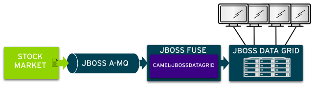

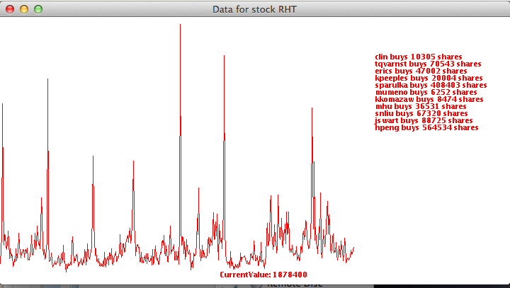

To run the demo
-----------------

1. Open a terminal

1. Clone this git repo TODO: add url

	    git clone <URL>

1. Change current directory to the cloned directory

1. Download the software and place it in the `installs` directory

1. Run the `init.sh` script to install JBoss Fuse and deploy the application

	   sh init.sh

1. Login to Fuse management console

	   http://localhost:8181    (u:admin/p:admin)
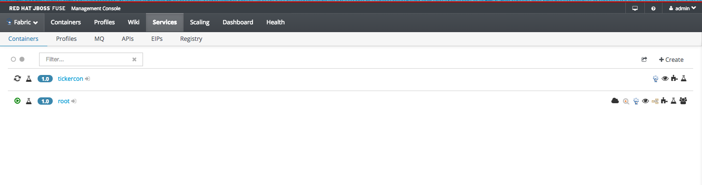

2. Go to Services Tab, under container, find containt `tickercon`, add profile `demo-jdg-stockticker` to tickercon container

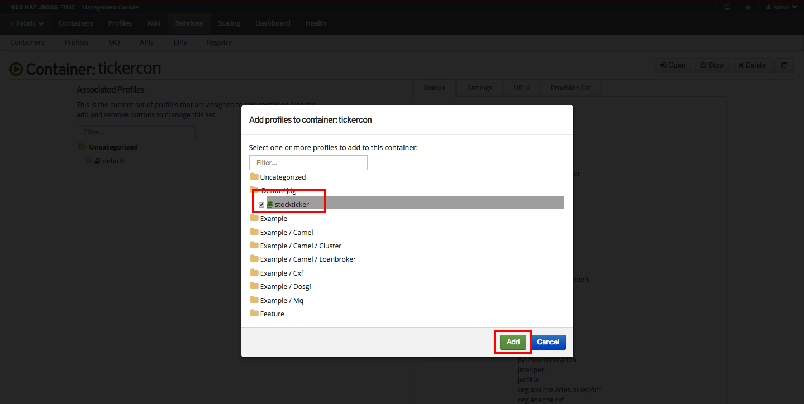
3. Start a stock plotter client

	   sh support/start-client.sh

1. Start stock ticker by providing quote and order, place the `/support/stockorderRHT1001.xml file` to

	   ./target/jboss-fuse-6.2.0.redhat-133/instances/tickercon/stockfolder

3. Watch as stock ticks are plotted in the client.

1. Open the Fuse console and verify that the processing of event.
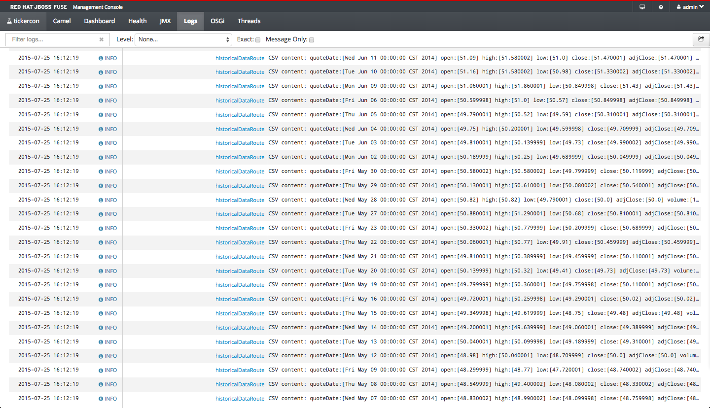
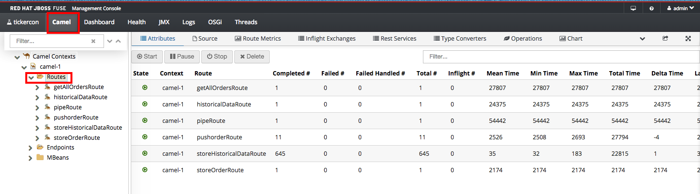
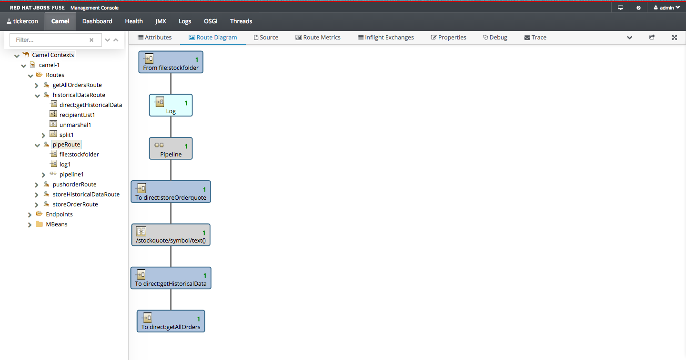
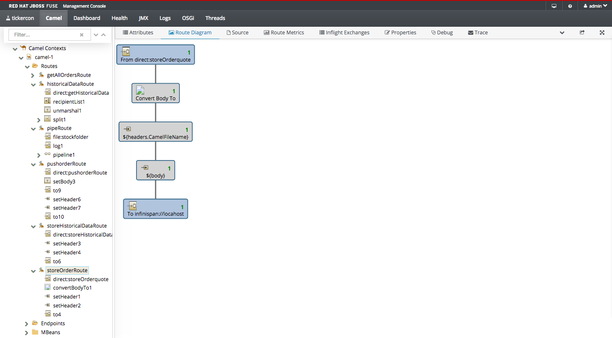
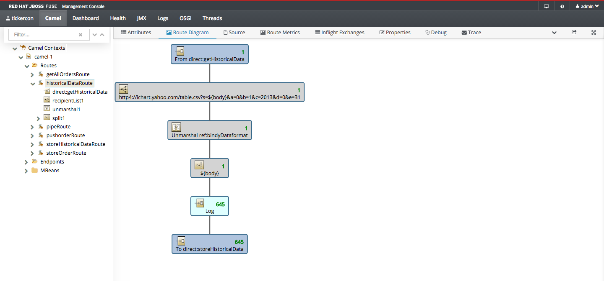
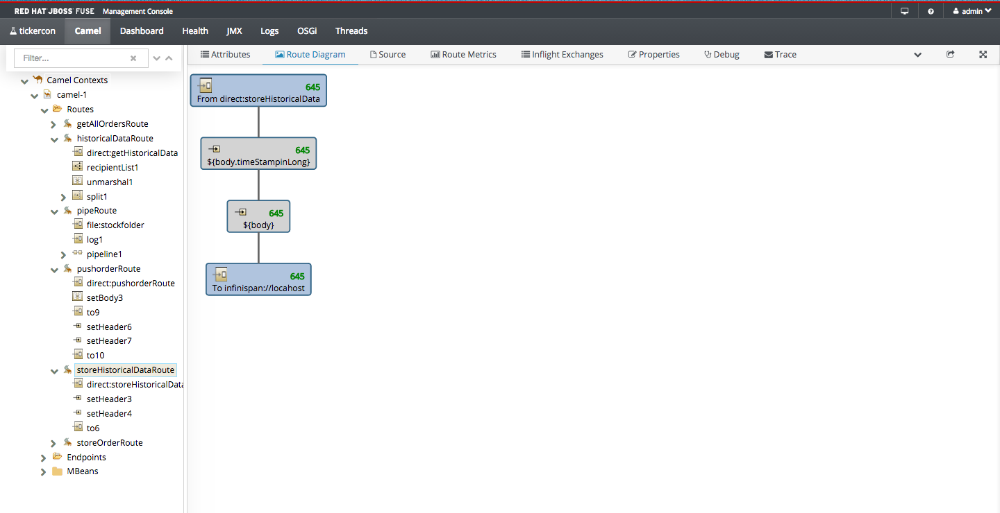
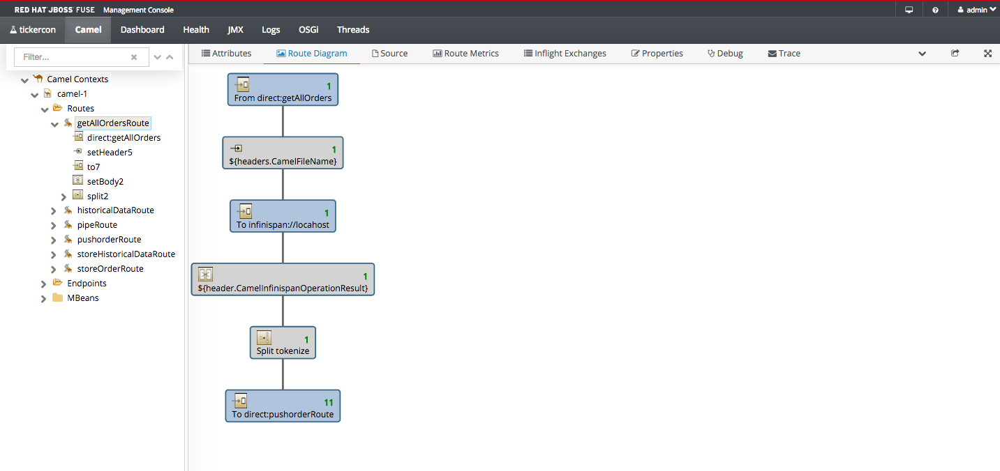
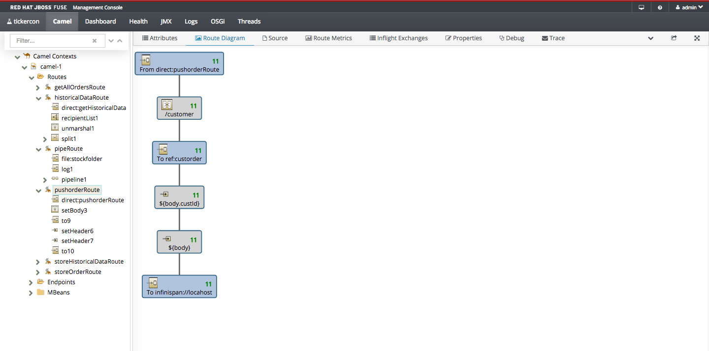

1. Done!
 
